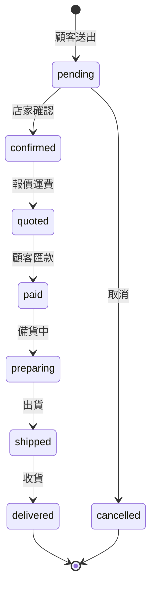
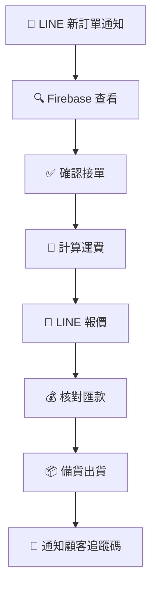

# 🟠 BIZ — 訂單生命週期與通知系統

從「顧客送出預購」到「商品送達」的完整流程與自動通知。

---

## 1. 訂單狀態機



### 狀態定義

| 狀態        | 說明       |
| :---------- | :--------- |
| `pending`   | 待確認     |
| `confirmed` | 已確認接單 |
| `quoted`    | 已報價運費 |
| `paid`      | 已付款     |
| `preparing` | 備貨中     |
| `shipped`   | 已出貨     |
| `delivered` | 已送達     |
| `cancelled` | 已取消     |

---

## 2. 通知矩陣

| 事件     | → 店家      | → 顧客       | 管道        |
| :------- | :---------- | :----------- | :---------- |
| 新訂單   | 🔔 即時推播 | —            | LINE Notify |
| 確認接單 | —           | 💬 通知      | LINE 私訊   |
| 報價運費 | —           | 💬 金額+匯款 | LINE 私訊   |
| 收款確認 | 🔔 備貨提醒 | —            | LINE Notify |
| 出貨     | 🔔 記錄     | 💬 追蹤碼    | 雙方        |
| 取消     | 🔔 記錄     | 💬 原因      | 雙方        |

---

## 3. LINE Notify 整合

```bash
firebase functions:config:set line.notify_token="YOUR_TOKEN"
```

```typescript
async function sendLineNotify(message: string): Promise<void> {
  const token = functions.config().line.notify_token;
  await fetch('https://notify-api.line.me/api/notify', {
    method: 'POST',
    headers: {
      Authorization: `Bearer ${token}`,
      'Content-Type': 'application/x-www-form-urlencoded',
    },
    body: `message=${encodeURIComponent(message)}`,
  });
}
```

---

## 4. Firestore Trigger

```typescript
export const onOrderStatusChange = functions.firestore
  .document('orders/{orderId}')
  .onUpdate(async (change) => {
    const before = change.before.data();
    const after = change.after.data();
    if (before.status === after.status) return;
    switch (after.status) {
      case 'confirmed':
        await notifyCustomerConfirmed(after);
        break;
      case 'shipped':
        await notifyCustomerShipped(after);
        break;
      case 'cancelled':
        await notifyBothCancelled(after);
        break;
    }
  });
```

---

## 5. 訂單編號規則

格式：`#ORD-{YYYYMMDD}-{三位流水號}`（例：`#ORD-20260512-001`）

---

## 6. 每日營運 SOP


