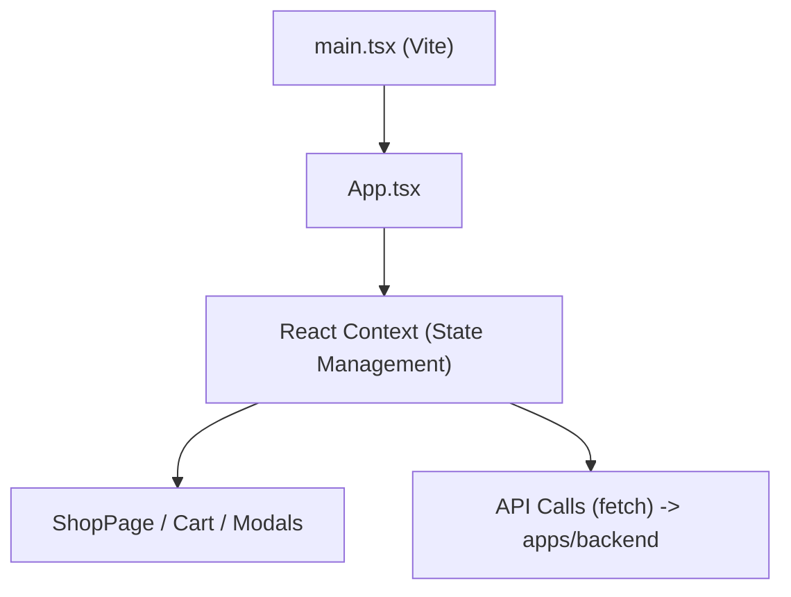

# 🔵 DES — 技術架構與專案結構

記錄專案目錄、編譯管道、開發腳本與模組載入流程。

---

## 1. 技術堆疊

| 層次 | 技術 |
|------|------|
| 專案管理 | Turborepo (Monorepo) |
| 前端框架 | React 18 + TypeScript + Vite |
| 前端樣式 | Vanilla CSS (Variables + Flexbox + Grid + RWD) |
| 後端框架 | Node.js + Express (Firebase Functions) |
| 共用模組 | 內部套件 `@yogo/shared` |
| 程式碼品質 | ESLint + Prettier |

## 2. 目錄結構

```text
YoGo/
├── apps/
│   ├── frontend/                 # 🌐 前端應用程式 (React + Vite)
│   │   ├── public/               # 靜態資產 (img, 舊有 HTML)
│   │   ├── src/                  # React 組件與邏輯
│   │   │   ├── components/       # 共用 React 組件
│   │   │   ├── hooks/            # 自訂 Hooks (原 data.ts/shop.ts 邏輯)
│   │   │   ├── pages/            # 頁面級組件
│   │   │   ├── App.tsx           # 前端進入點
│   │   │   └── main.tsx          # Vite 掛載點
│   │   ├── index.html            # Vite 進入點
│   │   └── package.json, vite.config.ts
│   └── backend/                  # ⚙️ 後端 API (Express + Firebase)
│       ├── src/                  # 後端原始碼
│       │   └── index.ts
│       └── package.json, tsconfig.json
├── packages/
│   └── shared/                   # 📦 前後端共用型別與工具
│       ├── src/
│       │   └── index.ts
│       └── package.json
├── docs/                         # 📄 SDLC 規格文件庫
├── turbo.json                    # Turborepo 設定
└── package.json, .eslintrc.js, .prettierrc
```

## 3. NPM Scripts (Root)

```json
{
  "build": "turbo run build",
  "dev": "turbo run dev",
  "watch": "turbo run watch",
  "deploy": "firebase deploy",
  "lint": "turbo run lint",
  "format": "prettier --write \"**/*.{ts,tsx,js,jsx,json,md,html,css}\""
}
```

## 4. 模組與資料流 (前端)



開發與編譯皆由 Vite 處理，提供極速的 HMR (Hot Module Replacement) 開發體驗，並在生產環境自動進行程式碼壓縮與 Tree-shaking。
