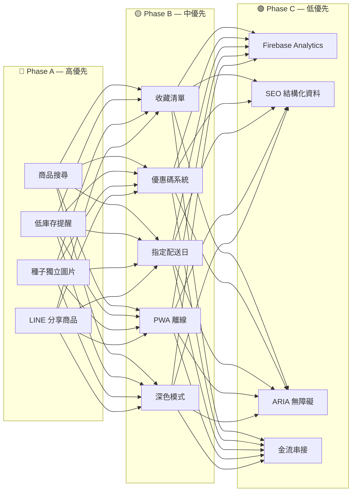
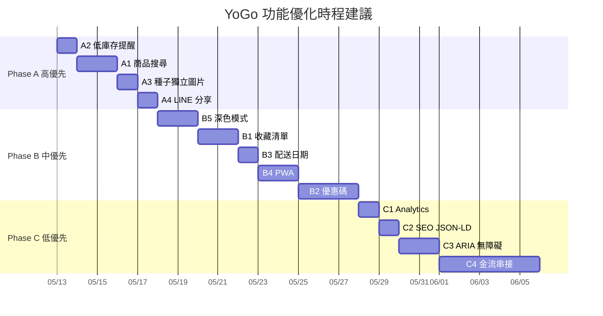

# 🟢 PRD — 功能優化路線圖 (Feature Roadmap)

本文件規劃 **YoGo 有夠菜** 網站在現有核心功能之上的優化方向，依業務影響力分為三個優先層級，並標明各功能的技術實作要點與相依關係。

---

## 📊 路線圖總覽



---

## 🔴 Phase A — 高優先（直接提升轉換率）

### A1. 商品即時搜尋與關鍵字過濾

| 項目 | 說明 |
| :--- | :--- |
| **需求背景** | 33 項商品已有一定規模，顧客需快速找到目標商品 |
| **使用者故事** | 身為顧客，我希望在搜尋框輸入「花生」，立即只看到花生相關的商品 |
| **介面設計** | 在分類 Tabs 上方新增搜尋輸入框，帶有 🔍 圖示與「搜尋商品名稱...」placeholder |
| **技術要點** | 監聽 `input` 事件，對 `PRODUCTS` 陣列執行 `name.includes(keyword)` 即時過濾，隱藏不匹配的卡片（使用 CSS `.hidden`），清空搜尋時恢復全部 |
| **新增檔案** | `src/search.ts` |
| **相依** | `DEV-frontend-modules`（商品渲染模組） |

---

### A2. 低庫存急迫提醒

| 項目 | 說明 |
| :--- | :--- |
| **需求背景** | 稀缺感能有效推動購買決策（FOMO 效應） |
| **使用者故事** | 身為顧客，看到「僅剩 3 件」會讓我更快下單 |
| **觸發條件** | `product.stock > 0 && product.stock <= 5` |
| **介面設計** | 商品卡片右上角顯示紅色圓角標籤：`🔥 僅剩 {stock} 件` |
| **技術要點** | 在 `src/shop.ts` 的 `renderProductCard()` 中加入條件渲染 |
| **新增業務規則** | 在 `PRD-business-rules` 新增「低庫存門檻 = 5」常數 |

```css
.low-stock-badge {
  position: absolute;
  top: 8px;
  right: 8px;
  background: #e74c3c;
  color: #fff;
  font-size: 0.75rem;
  padding: 2px 8px;
  border-radius: 12px;
  animation: pulse 1.5s infinite;
}
```

---

### A3. 種子商品獨立圖片

| 項目 | 說明 |
| :--- | :--- |
| **需求背景** | 目前 ID 4~20 共 17 項種子零售共用一張 `seeds-package.png`，辨識度極低 |
| **改善方案** | 使用 AI 繪圖工具為各種子類型生成差異化的包裝圖片 |
| **最小可行方案** | 至少區分 5 大類圖：十字花科（紫高麗/青花椰/羽衣甘藍/黑芥藍）、豆類（綠豆/黑豆/黃豆）、穀類（蕎麥/小麥草）、特殊（芝麻/苜蓿/花生）、蘿蔔嬰 |
| **影響範圍** | `PRD-product-catalog`（影像映射表更新）、`src/data.ts`（img 路徑更新） |

---

### A4. LINE 一鍵分享商品

| 項目 | 說明 |
| :--- | :--- |
| **需求背景** | 台灣用戶高度依賴 LINE 社群分享，口碑傳播是小店核心增長引擎 |
| **使用者故事** | 身為顧客，我在 Detail Modal 看到好商品，想一鍵分享給 LINE 好友 |
| **介面設計** | Detail Modal 右上角新增綠色 LINE 分享按鈕 |
| **技術實作** | 使用 LINE URL Scheme 開啟分享：|

```typescript
function shareToLine(product: Product): void {
  const text = `🌱 推薦你 YoGo 有夠菜的「${product.name}」只要 $${product.price}！\n👉 ${window.location.href}`;
  const url = `https://social-plugins.line.me/lineit/share?url=${encodeURIComponent(window.location.href)}&text=${encodeURIComponent(text)}`;
  window.open(url, '_blank');
}
```

---

## 🟡 Phase B — 中優先（提升使用體驗）

### B1. 收藏 / 願望清單

| 項目 | 說明 |
| :--- | :--- |
| **介面** | 每張商品卡片右上角新增 `♡` 愛心按鈕，點擊切換為 `❤️` 已收藏 |
| **儲存** | Phase 1 用 `localStorage('yogo_wishlist')`，Phase 2 可綁定 Firebase Auth 用戶 |
| **額外頁面** | Header 新增「我的收藏」入口，顯示已收藏商品列表，可一鍵全部加入購物車 |

---

### B2. 優惠碼折扣系統

| 項目 | 說明 |
| :--- | :--- |
| **介面** | 結帳 Step 1 底部新增「輸入優惠碼」輸入框 + 「套用」按鈕 |
| **驗證流程** | 前端比對硬編碼的優惠碼清單（Phase 1）或查詢 Firestore `coupons` 集合（Phase 2） |
| **折扣類型** | 支援「固定金額折抵」與「百分比折扣」兩種 |

```typescript
interface Coupon {
  code: string;         // 如 "YOGO2026"
  type: 'fixed' | 'percent';
  value: number;        // fixed: 折抵金額, percent: 折扣百分比 (如 10 = 打九折)
  minOrderAmount: number; // 最低消費門檻
  expiresAt: string;    // ISO 日期
  active: boolean;
}
```

---

### B3. 指定希望配送日期

| 項目 | 說明 |
| :--- | :--- |
| **介面** | 結帳 Step 2 新增 `<input type="date">` 日期選擇器 |
| **限制** | 最早可選日期為下單後 2 個工作天，最晚為 14 天內 |
| **用途** | 店家可依此排程採收新鮮芽菜與安排物流，減少溝通來回 |
| **Firestore** | `orders` 文件新增 `preferred_delivery_date` 欄位 |

---

### B4. PWA 漸進式 Web 應用

| 項目 | 說明 |
| :--- | :--- |
| **效果** | 手機用戶可將 YoGo 「加入主畫面」，獲得如原生 App 的啟動體驗 |
| **實作** | 新增 `public/manifest.json` + `public/sw.js`（Service Worker） |
| **離線策略** | Cache-First 策略快取商品圖片與 CSS/JS，Network-First 策略處理 API |

```json
{
  "name": "YoGo 有夠菜 - 芽菜工坊",
  "short_name": "YoGo",
  "start_url": "/index.html",
  "display": "standalone",
  "background_color": "#f8f9fa",
  "theme_color": "#2d6a4f",
  "icons": [{ "src": "img/brand/logo.png", "sizes": "192x192", "type": "image/png" }]
}
```

---

### B5. 深色模式

| 項目 | 說明 |
| :--- | :--- |
| **自動** | 偵測 `prefers-color-scheme: dark` 系統設定 |
| **手動** | Header 新增 🌙/☀️ 切換按鈕，偏好存入 `localStorage` |
| **實作** | 在 `style.css` 加入 `[data-theme="dark"]` 選擇器覆寫所有 CSS 變數 |

```css
[data-theme="dark"] {
  --bg-main: #1a1a2e;
  --card-bg: #16213e;
  --text-dark: #e0e0e0;
  --glass-bg: rgba(30, 30, 50, 0.8);
}
```

---

## 🟢 Phase C — 低優先（錦上添花）

### C1. Firebase Analytics 事件追蹤

| 事件名稱 | 觸發時機 | 目的 |
| :--- | :--- | :--- |
| `view_item` | 開啟 Detail Modal | 追蹤商品瀏覽熱度 |
| `add_to_cart` | 加入購物籃 | 分析加購率 |
| `begin_checkout` | 開啟結帳 Modal | 分析結帳入口轉換 |
| `purchase` | Step 4 完成 | 追蹤成交率 |
| `search` | 搜尋輸入 | 分析顧客需求 |

---

### C2. SEO 結構化資料 (JSON-LD)

在 `index.html` 的 `<head>` 中注入 Product schema，讓 Google 搜尋結果顯示價格與庫存狀態：

```html
<script type="application/ld+json">
{
  "@context": "https://schema.org",
  "@type": "WebSite",
  "name": "YoGo 有夠菜 - 芽菜工坊",
  "url": "https://yogo-sprouts.web.app",
  "description": "高品質芽菜種子、新鮮芽菜與花生芽加工品線上預購平台"
}
</script>
```

---

### C3. ARIA 無障礙標籤

| 元素 | 加入屬性 |
| :--- | :--- |
| Detail Modal | `role="dialog"`, `aria-modal="true"`, `aria-labelledby` |
| Checkout Modal | `role="dialog"`, `aria-label="結帳表單"` |
| 數量 +/- 按鈕 | `aria-label="增加數量"` / `aria-label="減少數量"` |
| 商品圖片 | 確保每張 `` 都有描述性 `alt` |
| 售完商品 | `aria-disabled="true"` |

---

### C4. 金流串接（LINE Pay / 綠界 ECPay）

| 項目 | 說明 |
| :--- | :--- |
| **取代流程** | 目前的手動匯款+末五碼對帳 → 線上即時付款 |
| **推薦方案** | **綠界 ECPay** 或 **LINE Pay**（台灣在地支付普及率最高） |
| **架構影響** | 需在 Cloud Functions 中新增付款 API、回調驗證 webhook |
| **前端影響** | 結帳 Step 3 改為「導向付款頁」而非「確認匯款」 |
| **相依** | `DEV-backend-api`（新增 payment API）、`BIZ-order-lifecycle`（paid 狀態自動化） |

---

## 📋 實作優先排序建議


