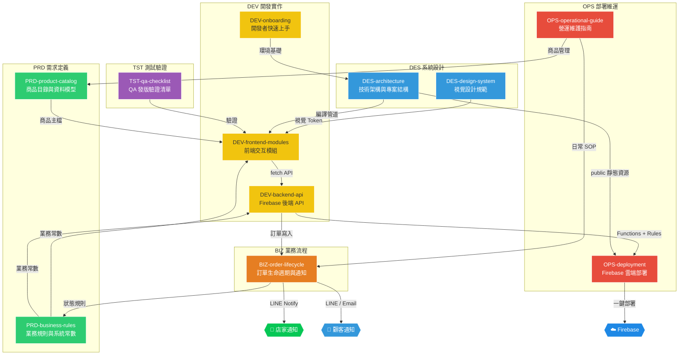

# YoGo 有夠菜 - 芽菜工坊 🌱

## 專案規格文件庫 (Specification Library)

> **版本** v2.0 ｜ **更新** 2026-05-12 ｜ **架構** Firebase Serverless 全家桶

本文件庫以 **SDLC (軟體開發生命週期)** 為骨幹，結合 **訂單生命週期 (Order Lifecycle)** 的業務流程，將所有規格依「階段前綴」進行編碼，確保每份文件的定位一目了然。

---

## 🏷️ 文件編碼規則 (Naming Convention)

```
{SDLC階段前綴}-{主題名稱}.md
```

| 前綴 | SDLC 階段 | 色標 | 說明 |
| :--- | :--- | :--- | :--- |
| `PRD-` | **需求定義** (Product Requirements) | 🟢 | 業務需求、商品主檔、業務規則 |
| `DES-` | **系統設計** (System Design) | 🔵 | 視覺設計規範、技術架構藍圖 |
| `DEV-` | **開發實作** (Development) | 🟡 | 功能模組規格、API 設計、開發者指南 |
| `TST-` | **測試驗證** (Testing & QA) | 🟣 | 發版前測試清單、驗收標準 |
| `OPS-` | **部署維運** (Operations) | 🔴 | 雲端部署、日常營運管理 |
| `BIZ-` | **業務流程** (Business Process) | 🟠 | 訂單生命週期、通知系統、金流 |

---

## 🔗 SDLC × 訂單生命週期 關聯總覽 (Mermaid)



---

## 📁 文件索引 (Sitemap)

### 🟢 PRD — 需求定義

#### [PRD-product-catalog — 商品目錄與資料模型](./PRD-product-catalog.md)
- 33 項完整商品主檔（6 大分類、雙溫層配送）
- TypeScript 資料型別定義 (`Product`, `Category`, `CartState`)
- 影像資產路徑映射表（13 張高解析圖片）

#### [PRD-business-rules — 業務規則與系統常數](./PRD-business-rules.md)
- 免運門檻（冷藏 $2,000 / 常溫 $800）、庫存售完邏輯
- 管理員觸發條件（5 次 / 2 秒）、結帳表單驗證
- UI 動畫時間常數、每條規則標明程式碼位置

#### [PRD-feature-roadmap — 功能優化路線圖](./PRD-feature-roadmap.md)
- 13 項功能優化規劃，分三階段（A 高優先 / B 中優先 / C 低優先）
- 含商品搜尋、低庫存提醒、LINE 分享、優惠碼、PWA、深色模式、金流串接等
- 每項功能含使用者故事、技術要點與 Gantt 時程建議

### 🔵 DES — 系統設計

#### [DES-design-system — 視覺設計規範](./DES-design-system.md)
- 色彩系統（深森林綠、嫩芽綠、花生金黃）
- Glassmorphism 毛玻璃擬態、微交互彈性動畫
- RWD 響應式斷點與觸控優化

#### [DES-architecture — 技術架構與專案結構](./DES-architecture.md)
- `src/` → `public/js/` TypeScript 編譯管道
- 完整目錄樹、tsconfig.json、NPM Scripts
- 模組載入流程與 DOMContentLoaded 初始化

### 🟡 DEV — 開發實作

#### [DEV-onboarding — 開發者快速上手](./DEV-onboarding.md)
- 5 分鐘本地環境建置指南
- Windows PowerShell、TS 後綴、瀏覽器快取等常見故障排除

#### [DEV-frontend-modules — 前端核心功能模組](./DEV-frontend-modules.md)
- 商品詳情多圖輪播彈窗 (Detail Modal)
- 四階段漸進式結帳表單 (Checkout 4-Step)
- 吸頂滾動偵測導覽 (ScrollSpy)
- 管理員隱藏入口 (Admin Trigger)

#### [DEV-backend-api — Firebase 後端 API 規劃](./DEV-backend-api.md)
- Cloud Firestore NoSQL Schema (`products` / `orders`)
- Cloud Functions HTTPS Triggers (`GET /api/products` / `POST /api/checkout`)
- Firestore Transaction 庫存鎖定與安全規則

### 🟣 TST — 測試驗證

#### [TST-qa-checklist — QA 發版驗證清單](./TST-qa-checklist.md)
- 9 大類 40+ 項 checkbox 逐項驗證
- 涵蓋商品渲染、購物車、結帳、ScrollSpy、RWD、瀏覽器相容性
- 可直接複製到 PR / Issue 打勾使用

### 🔴 OPS — 部署維運

#### [OPS-deployment — Firebase 雲端部署](./OPS-deployment.md)
- Firebase CLI 安裝、初始化與互動問答導引
- `firebase.json` 路由轉發與快取設定
- `firestore.rules` 安全性規則、本地模擬器與一鍵部署

#### [OPS-operational-guide — 營運維護指南](./OPS-operational-guide.md)
- 非技術人員的商品價格 / 售完狀態修改教學
- Firebase Console 訂單查詢與 Excel 導出

### 🟠 BIZ — 業務流程

#### [BIZ-order-lifecycle — 訂單生命週期與通知系統](./BIZ-order-lifecycle.md)
- 訂單 8 階段狀態機 (`pending → confirmed → quoted → paid → shipped → delivered`)
- LINE Notify 店家即時推播 + 顧客 LINE/Email 狀態通知
- Firestore onUpdate Trigger 自動化、訂單編號規則、每日營運 SOP 流程圖

### 📝 輔助文件

#### [CHANGELOG — 變更歷史](./CHANGELOG.md)
- 追蹤所有重大架構決策與規格變更記錄

---

## 📖 專業術語對照表 (Glossary)

| 術語 | 英文 | 定義 |
| :--- | :--- | :--- |
| **SDLC** | Software Development Life Cycle | 軟體開發生命週期，從需求→設計→開發→測試→部署→維運的標準流程 |
| **常溫商品** | Ambient | 無需冷藏之包裝商品（種子、套組、零配件、乾燥花生加工品） |
| **冷藏商品** | Chilled | 需低溫冷鍊配送之新鮮商品（芽菜、即飲咖啡） |
| **免運門檻** | Free Shipping Threshold | 冷藏 $2,000 / 常溫 $800，各自獨立計算 |
| **彈窗** | Modal | 覆蓋主頁面的互動對話框 |
| **ScrollSpy** | Scroll Spy | 滾動偵測並自動高亮導覽按鈕 |
| **Firestore Transaction** | — | 原子性讀寫操作，保證庫存扣減不會超賣 |
| **LINE Notify** | — | LINE 免費推播服務，用於店家接單即時通知 |

---

## 📋 實作與規劃狀態 (Status Tracker)

| 功能模組 | 狀態 | 對應文件 |
| :--- | :--- | :--- |
| 商品詳情彈窗 | ✅ 已實作 | `DEV-frontend-modules` |
| 四步驟結帳彈窗 | ✅ 已實作 | `DEV-frontend-modules` |
| 吸頂滾動偵測 | ✅ 已實作 | `DEV-frontend-modules` |
| 管理員隱藏入口 | ✅ 已實作 | `DEV-frontend-modules` |
| Firebase 靜態託管 | 📋 待串接 (Phase 1) | `OPS-deployment` |
| Serverless API | 📋 待實作 (Phase 2) | `DEV-backend-api` |
| Cloud Firestore | 📋 待實作 (Phase 2) | `DEV-backend-api` |
| LINE Notify 通知 | 📋 待實作 (Phase 2) | `BIZ-order-lifecycle` |
| 訂單狀態自動推播 | 📋 待實作 (Phase 2) | `BIZ-order-lifecycle` |
